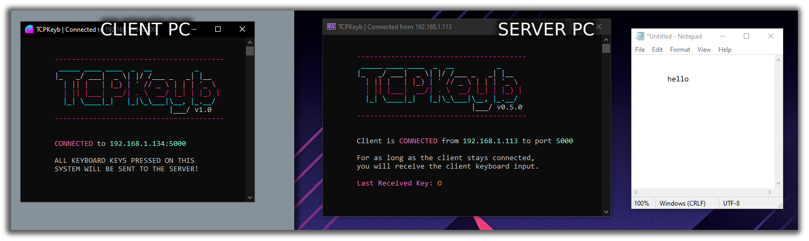

Send keystrokes over a network from one Windows computer to another.

## Running Requirements
- Windows x64/x86

## Building Requirements
- Microsoft Visual Studio w/ .NET Core 3.1

## Installation

Download the [latest version release](https://github.com/fuzzymannerz/TCPKeyb/releases/latest) and run it. It runs as a standalone application (.NET requirements are packaged in with the EXE) so no need to install it.   
*Note: If you don't know if you need x64 or x86, try x64 first and if it doesn't work, grab the other one instead.*  

## Usage

You'll be presented with options upon running the software but you can run either a client or a server.  
The server is the system that receives the keystrokes whilst the client is the one that sends them.

Even if you minimise TCPKeyb it will still capture keyboard keys and send or receive them.

### Important Notice
This software was created to fit a very particular use case of sending keystrokes over a LAN to control aspects of a game to be affected by viewers on a Twitch streaming PC to gaming PC. 

I am well aware that this same software could potentially be used for nefarious purposes and I would like to take this moment to severely discourage the use of this software in illegal or otherwise morally questionable scenarios. I know this wouldn't stop anyone who was going to do it regardless but I absolutely do **not** allow or expect this software to be used for things of that nature. Please play nice and use this application responsibly. Thank you.

## Contributing
Pull requests are welcome. For major changes, please open an issue first to discuss what you would like to change.

# Limitations & Known Issues
TCPKeyb as it currently stands has some know limitations and issues.  
They are subject to being fixed (or features added) in future releases.

- The client does not poll the server so if a server disconnects, it takes a keypress before the client will notice.
- The program will only send individual keystrokes. CTRL+A for example will only send CTRL, LSHIFT+T will only send LSHIFT and so on.
- Keys cannot currently be "held", just pressed/released. Holding 'N' for example will just send one singular 'N' press.

## License
[GNU AGPL 3.0](https://choosealicense.com/licenses/agpl-3.0/)

## Show Some <3
If you get some use from TCPKeyb feel free to buy me a chocolate bar or coffee.  

**Ko-Fi:** [https://ko-fi.com/fuzzy]()  
**BTC:** 1DUJH2kqccDpTHHSCXDkRGhxtvXm9PdnkN  
**DOGE:** DNZbJrxv6UmeHziZAUDCBi7UDLsQHAkPdq

## Credits
TCPKeyb currently uses [Colorful.Console](https://github.com/tomakita/Colorful.Console) for text colouring.